# Agent Network Architecture

How two machines join one agent network through a directory (kollabor.ai or your own domain), what crosses the wire, and what keeps each device online. The example is your Mac joining a brand-new VPS. The contract is [agent-network-simple-flow.md](../specs/agent-network-simple-flow.md); the user guide is [connect.md](../guides/connect.md).

The diagrams come from [`scripts/build_network_diagrams.py`](../../scripts/build_network_diagrams.py). Change a label there when the code changes, then run it.

## Who Connects to Whom

<picture>
  <source media="(prefers-color-scheme: dark)" srcset="../diagrams/agent-network/topology-dark.svg">
  
</picture>

Both machines dial out and neither accepts a connection, so NAT, a home router or a closed VPS firewall all work. Each daemon keeps one `wss` link to the directory's TLS proxy on port 443, and the relay hands frames from one device to another in the same room. SSH is only how you type on the VPS.

## The Join, Step by Step

<picture>
  <source media="(prefers-color-scheme: dark)" srcset="../diagrams/agent-network/join-dark.svg">
  
</picture>

Three steps are yours: `/connect` on the Mac, typing the code on the VPS, pressing `a` on the Mac. Steps 4 to 23 are HTTPS calls to a short-lived mailbox on the directory, sealed with a key made from the code, which the directory never sees.

- The code lives 5 minutes and admits one device.
- The Mac polls the mailbox every 15 s; the VPS every 5 to 20 s.
- A request is dropped after 10 minutes; lookups are limited to 10 a minute per IP.
- Device names default to `<hostname>-<folder>`. The name is saved the first time, and a workspace whose folder name another workspace on the computer already uses gets `<hostname>-<parent>-<folder>`, then a number. `/connect name` changes one.

## Inside the Tunnel

<picture>
  <source media="(prefers-color-scheme: dark)" srcset="../diagrams/agent-network/layers-dark.svg">
  
</picture>

The relay routes on the key in layer 2 and never decrypts layer 3. The Box keys come from each device's Ed25519 key, converted to Curve25519. Join steps 4 to 23 use the code-key envelopes instead, since no TLS session exists yet.

## What Travels, What Stays

| Item | Reaches the VPS? | How | The directory sees |
| --- | --- | --- | --- |
| Join code | Only through you: read on the Mac, typed on the VPS | Never sent | Two hashes made from it |
| Private device keys | Never | Stay in `~/.kollab/network/<id>/` | Nothing |
| Public device keys | Yes | In every frame | Yes, they are the addresses |
| Device name | Yes | In the join request | Yes |
| Membership credential, room invite, network name | Once, when you accept | Sealed with the code key | Ciphertext |
| Active LLM profile and its API key | Once, when you accept | Sealed to the VPS key, inside the code-key envelope | Ciphertext |
| Settings, loadouts, MCP servers, API keys, `agents/`, `skills/` | On every change and on reconnect | Signed by the Mac, sealed to the VPS key, inside TLS-in-Box | Ciphertext, size, timing |
| Agent messages | When an agent sends one | TLS 1.3 inside Box | Size, timing, the two keys |
| ChatGPT and other OAuth logins | Never | Run `/login` on each machine | Nothing |
| Project `.kollab/`, vaults, conversations | Never | Stay local | Nothing |

- Default trust is `open`: any agent on either machine can message any other, and each runs a message with its own tools under its own permissions. `/connect trust agents` or `manual` tightens it.
- A synced MCP server runs on the VPS as your user as soon as it lands; one whose command isn't installed there is skipped. Joining means trusting the Mac to run what it sends. `/connect revoke` ends it.
- Revoking a device doesn't revoke an API key at the provider. Rotate the key there.

## Staying Online

<picture>
  <source media="(prefers-color-scheme: dark)" srcset="../diagrams/agent-network/lifecycle-dark.svg">
  
</picture>

The daemon is the device: while it runs, the machine is on the network, with or without a window.

- **The device is the folder.** Its identity lives in `~/.kollab/network/<sha256 of the folder path>/`. Kollab started in another folder is a different device and needs its own code.
- **Keep it on** with `kollab service install` in that folder: a systemd unit on Linux (starts at boot) or a LaunchAgent on macOS (starts at login), restarted 5 s after it stops. `kollab` there attaches to it, and closing that window leaves it running. See [Attach Mode](../features/attach-mode.md#keep-it-running-kollab-service).
- When the link drops, the daemon redials by itself: about 1 s after a working connection, backing off to 30 s while the directory is unreachable.
- A message to an offline device waits in the sender's outbox and is retried every second until its deadline, an hour at most. The directory stores nothing; a frame for an offline device bounces with `peer_offline`.
- SSH logout leaves the daemon running because it has its own session, except on a server whose systemd-logind sets `KillUserProcesses=yes`.

## How the Domain Works

<picture>
  <source media="(prefers-color-scheme: dark)" srcset="../diagrams/agent-network/discovery-dark.svg">
  
</picture>

DNS chooses where to look; the signature decides what to trust. A device that pinned a key refuses a different one until a person re-pairs it. kollabor.ai works the same way.

- **At startup** `kollab relay serve --domain` takes a lock on its state directory, creates `service.key` (mode 0600) the first time, signs an identity-only key file, then listens on `127.0.0.1:9078` and prints the TXT record and the five proxy routes.
- **Every 60 s** it signs revision N+1 with a 5-minute expiry. The file names the relay only while the relay is ready, so a broken relay drops out within a minute, and a file nobody renews expires in five.
- **Revisions only go up.** Each number is saved before its file is written, and a device refuses any revision lower than one it has seen (`rollback`).
- **Lose the key, lose the pins.** A new `service.key` makes every device that pinned the old one stop with `key_changed`. Back up `~/.kollab/relay/<domain>/`.

Code: `plugins/hub/dns/discovery.py` (TXT and key-file checks), `discovery_store.py` (pins), `discovery_publish.py` (signing).

## Run Your Own Directory

<picture>
  <source media="(prefers-color-scheme: dark)" srcset="../diagrams/agent-network/selfhost-dark.svg">
  
</picture>

```bash
uv tool install kollab                                   # on a server whose A/AAAA record is the domain
kollab relay serve --domain agents.example.com           # creates the key, prints what is left to do
#   DNS:   _agent.agents.example.com  TXT  "v=aid1;u=https://agents.example.com/.well-known/agent-keys.json"
kollab relay serve --domain agents.example.com --print nginx    # or --print caddy: the four routes behind TLS
kollab relay serve --domain agents.example.com --install        # systemd, at boot (stop the foreground copy first)
/connect agents.example.com                              # on each device
```

Check it from outside: `dig +short TXT _agent.agents.example.com`, then `curl https://agents.example.com/relay/v1/health`; `/relay/v1/metrics` must answer 404. One process means one in-memory worker: a restart ends waiting join codes and knocks, and devices reconnect on their own. Options and limits: [Signed discovery and relay service operations](../operations/kollabor-ai-discovery-publication.md).

## What kollabor.ai Runs

<picture>
  <source media="(prefers-color-scheme: dark)" srcset="../diagrams/agent-network/kollaborai-dark.svg">
  
</picture>

The same relay code, split for more than one worker: `kollab relay run --config` supervises workers on a shared backend, and a separate publisher signs the key file. Use this form only when one process isn't enough.
