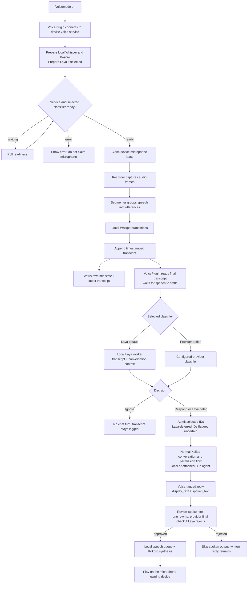
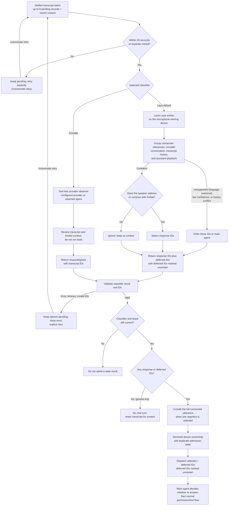

# Voice mode

Run `/voicemode on` in the chat that should respond to you. Kollab prepares local
voice support in the background, downloads Whisper base, the default Kokoro
voice and the default Laya classifier, warms them, then starts the microphone. There is no
model picker. The input box stays usable during setup.

Use `/voicemode status` to inspect setup/download progress, microphone activity,
model warmup, transcription, speech playback and errors. The transcript file uses
UTC timestamps. The compact status row shows mic state and, when space permits,
the latest transcript; it does not show the selected classifier or input-level meter.

- `/voicemode` toggles voice for this chat.
- `/voicemode on` makes this chat the responding conversation.
- `/voicemode off` releases its microphone lease and cancels unplayed speech.
- `/voicemode status` shows the service, owner, devices, transcript and queues.
- `/voicemode retry` retries failed setup or explicitly retries pending speech.
- `/voicemode classifier` shows the selected classifier and both choices.
- `/voicemode classifier laya` selects the default local classifier.
- `/voicemode classifier provider` selects the active AI provider instead.
- `/voicemode context` shows the recent transcript window (default 10 lines).
- `/voicemode context 20` changes it to 20 lines; the allowed range is 1–50.
- `/vm` and `/voice` are aliases. `/voicemodels` now shows status.

## Flow at a glance



## Intent decision detail

The classifier selects which transcript IDs should wake the responding agent; it
does not draft the answer. Provider classification is respond/ignore. Laya can
also defer uncertain or unsupported speech to the main agent.



Voice activates only through an explicit command. Starting another agent or
inheriting an old enabled setting never starts its microphone. The latest
explicit activation owns responses. An older chat shows Active Elsewhere.
Closing the owning chat stops capture when its three-second lease expires.
The shared service can remain idle with its models loaded. Classifier selection is
saved for this device; changing it preserves pending speech and does not enable
the microphone by itself.

## What is local

One process per OS user owns the microphone, speech models and speaker. It uses
Whisper base on CPU and Kokoro ONNX with `af_heart`. The lightweight agent client
has no audio dependencies. First use installs the pinned audio dependencies into
`~/.kollab/voice/runtimes/`; it does not install them into your agent environment.
Downloads resume and must match the sizes and SHA256 hashes in the bundled
manifest before loading. Verified models work offline. Laya runs in one persistent
Python worker owned by the device service, with its own pinned environment and
verified `typed-decisions` checkpoint. Multiple agents share the same worker;
changing the responding conversation does not reload idle model weights. Laya
uses a bundled voice intent head over its frozen checkpoint. The current
[local evaluation](../../packages/kollabor-voice/bench/README.md) records its
remaining classification errors and decisions deferred to the main agent; it is not a guarantee that all
background speech will be recognized correctly.

Data lives in `~/.kollab/voice/`:

- `transcripts/YYYY-MM-DD.jsonl`: timestamped recognized speech, including speech
  the AI ignores. Partial audio and explicit gaps are marked and never dispatched.
- `models/`: verified default models.
- `speech.jsonl`: queued, synthesizing, playing, played, failed or cancelled
  sentence receipts. Played means the audio device completed playback.
- `consumers/`: per-chat cursors and pending records for interrupted delivery.
- `admissions.sqlite3`: durable request identities used to avoid duplicate turns.
- `preferences.json`: selected classifier; never microphone activation.
- `logs/service.log` and `logs/laya.log`: setup and worker diagnostics.

Raw microphone audio is not saved. Owned, closed daily transcript files expire
after 30 days. Active files and legacy project transcripts are preserved. The
socket and transcript files are restricted to the current OS user.

## When the AI responds

After speech is written to the transcript, Laya decides locally whether it is
addressed to the assistant. A voice-specific decision contract includes the full
utterance, the previous 10 complete transcript lines by default, the last two
visible conversation messages and any overlapping assistant playback. Prior
transcript lines include ignored speech and already admitted requests. They are
context only and cannot be submitted again. The window clears when capture is
restarted and never includes a different microphone owner's session.

Laya compares its history-aware decision with the current utterance alone. If
they disagree, the main agent receives the full history and new words to decide.
This prevents a background-TV notice from acting as a blanket mute on a clear
new request. If the full transcript window exceeds Laya's context, it also goes
to the main agent intact. Confident background speech is ignored. Uncertain, unsupported-language
or oversized utterances go to the main agent with a note asking it to decide
whether the human expects a response. They do not block later speech.
The main agent responds normally when addressed, or returns exactly `.` to stay
silent. A response containing only that period never reaches speech synthesis.
Invalid results or provider failures pause admission with a visible error;
there is no automatic switch to another provider.
`/voicemode status` names the selected classifier and reports actual setup/readiness.

Choosing `provider` uses a separate tool-free request through the active chat's
AI profile. That option sends transcript text and limited recent conversation
context, including the recent transcript window, to the configured provider and
can incur inference charges. Accepted
speech still goes to the main agent under either classifier option. Local
classification does not make a hosted main agent local: uncertain speech also
reaches that agent. Once listening, an
unavailable classifier or agent does not stop durable transcription.

Connected speech segments are kept together, including a lead-in initially
classified as background speech. The observer waits for a pause and pending
transcription before admitting a request; selecting its question includes the
rest of that connected utterance.

Accepted requests enter the normal conversation queue and permission flow.
Assistant responses have separate `display_text` and `spoken_text` fields. The
full answer and code examples stay on screen. Only the spoken field reaches the
speech classifier and device queue; there is no fallback that reads display text.
Tool calls, tool results and private reasoning never become spoken content.

Before playback, the selected classifier checks that narration is one or two
short conversational sentences. Laya uses a separate style head over the same
loaded encoder. If Laya is unsure, the agent's configured provider performs a
tool-free style check of only the spoken text. Format limits still reject code,
lists, links, paths and long replies. A rejected spoken reply gets one tool-free nudge to the responding agent
to shorten it, then is checked again. If Laya rejects that rewrite despite valid
length and formatting, the configured provider makes one final style decision.
A missing spoken field is created on that host first. If correction fails, that
reply is skipped and status shows the reason; the written answer remains available.
The next reply is processed automatically and clears the earlier error when its
review starts. An empty spoken field or `.` means silence.

Brief updates before tools and final narration use the same sentence queue.
The `voice_out` tool uses that adapter for intentional spoken updates and returns
a nudge when its text is rejected. Repeating an admission does not repeat matching
sentences. Cancellation and ownership changes prevent a late rewrite from playing.

Laya classifies echoes using the transcript and overlapping playback text. There
is no text-match filter that discards speech before classification. Uncertain
echoes reach the main agent with the same playback context and silence instruction.
Overlapping speech remains in the transcript. This is not
acoustic echo cancellation. Recognition and response decisions can be imperfect;
use `/voicemode off` to close the microphone immediately.

If inference fails, the transcript remains pending instead of becoming an
automatic command. Unadmitted speech older than 30 seconds requires an explicit
retry. Once a request is admitted, its progress and final spoken replies can
arrive after that deadline while the same conversation still owns voice.
An ambiguous admission is reconciled with the durable host record rather than
blindly submitted again. Restarting or changing the owner starts at the current
transcript position and does not replay old speech.

Attached chats keep audio on the device running the TUI. Transcript observation
uses the local Laya worker by default, or the attached agent for the provider
option. Request admission runs through the attached agent; spoken replies come back
to the local speaker queue. No audio model or microphone starts in the remote
agent process.

## Agent integration

The owner can issue an output-only capability with the local `delegate` request.
Pass that capability explicitly to a background producer. It cannot read the
transcript, open the microphone, transfer ownership or extend the owner's lease.

```python
from kollabor_voice.client import VoiceClient

await VoiceClient().voice_out(
    text="The build finished. All checks passed.",
    reply_id="build-42-result",
    owner_epoch=capability["epoch"],
    producer_id=capability["producer_id"],
    token=capability["token"],
)
```

Queue overflow is an explicit rejection. Cancelled synthesis results cannot play
later, and cancelled playback is stopped. Speech interrupted by a service restart
is recorded as cancelled and is never automatically replayed.

Implementation and measured platform/acceptance coverage are recorded in
[`implementation-status.md`](../../specs/voice-mode/implementation-status.md).
