# Kollab speaks ACP

Status: **draft**, 2026-10-09, revised the same day after an adversarial
review. Not built. In Marco's words: "if all harness support acp and a kollab
agent needs to interact with a claude code agent or a codex agent, kollab agents
need to be able to speak acp … we don't need to replace the kollab protocol … if
we can bridge ACP with what kollab has, other non kollab agents can join the
mesh."

Kollab keeps its own protocols: the hub socket, attach, the network and the
engine API. It adds the [Agent Client Protocol](https://agentclientprotocol.com)
(ACP) in both directions, as the bridge to every other harness:

- **Outbound.** Claude Code, Codex, Gemini CLI or any ACP agent runs as a kollab
  agent: a name in the roster that gets and sends hub messages, opens in every
  window, and is reachable as `agent@device` on the network.
- **Inbound.** `kollab acp` makes kollab an ACP agent, so an ACP client such as
  Zed can drive a kollab agent.

<picture>
  <source media="(prefers-color-scheme: dark)" srcset="../diagrams/acp-bridge/overview-dark.svg">
  
</picture>

The diagrams come from [`scripts/build_acp_diagrams.py`](../../scripts/build_acp_diagrams.py).
Change a label there when this spec changes, then run it.

## 1. What you can do

| You can | How |
|---|---|
| Run Claude Code, Codex or Gemini CLI as a mesh member | `kollab --as claude --llm claude-code --detached`, or ask any agent: "start claude on Claude Code" |
| Have any agent ask it something | "lapis, ask claude to review my diff": `hub_msg to="claude"`. Its final message returns on lapis's thread |
| Let it start conversations and ask back | its kollab hub tools: `hub_msg`, `hub_ask` (waits for the answer), `hub_status`, `hub_agents` |
| Chat with it yourself | terminal attach, web UI, phone: it is a kollab agent |
| Reach it from another computer | `hub_msg to="claude@home-server"`. That device's trust decides |
| Approve its tools in kollab | its permission requests are kollab prompts in its windows, under your approval mode; from another agent's window, a line says it is waiting |
| Steer it while it works | type to it, or have the agent whose request it is working on send a follow-up on that thread: the message joins the running turn through `_session/steering`, which the Claude Code and Codex adapters implement |
| Stop it, clear it, resume it | Esc or Stop, `/clear`, `/resume`. Kollab says whether the harness resumed or starts fresh |
| Run kollab agents inside an ACP client | `kollab acp`, or `kollab acp --attach lapis`. Zed first; JetBrains, Buzz and T3 Code once their runs pass (section 9) |

## 2. What you can't do

| You can't | Why | Instead |
|---|---|---|
| Join a Claude Code window already open in a terminal | ACP starts its own agent process | start it under kollab; `/resume` picks up a stored session when the harness supports it |
| Pick its model, effort or billing from kollab | they belong to the harness and its login | set them in the harness |
| Gate every tool it runs | it asks only where its own rules say to, and kollab's config hooks never see its tools | keep its allow list tight and use its own hooks |
| Reuse an approval for a call it describes vaguely | kollab grants by exact command or file paths, never by a label | approve it once |
| Give it kollab's system prompt, skills or memory | ACP has no system prompt field | a short preface opens each session; its `CLAUDE.md` or `AGENTS.md` still apply |
| Let it read the whole open channel | it gets only your input and messages addressed to it | message it, or broadcast |
| Let it use kollab's tools | it runs its own tools | it gets kollab's hub tools only |
| Have another agent's new request join a running turn | its answer needs a turn of its own, or it would mix with the running one | it waits for the next turn |
| Steer a harness whose adapter has no steering | ACP v1 has no steering method; `_session/steering` is an extension the adapters agreed on | your message waits for the next turn; Esc stops the turn |
| Have harness agents ask each other in a circle inside one turn | each runs one prompt at a time | an agent waiting in `hub_ask` on someone else answers `busy` at once |
| Run ACP across the internet | ACP's only finished transport is stdio; its remote transport is a draft | the kollab network carries `claude@device`; ACP stays on each machine |
| Share its login between devices | the sealed config carries kollab's settings, not other harnesses' logins | log in once on each device that runs it |

Why these split where they do: kollab owns the agent, the harness owns the
brain, and ACP is the only wire between them.

<picture>
  <source media="(prefers-color-scheme: dark)" srcset="../diagrams/acp-bridge/ownership-dark.svg">
  
</picture>

## 3. Setup

Each device that runs a harness agent needs the harness's own CLI, to log in,
and its ACP adapter. These versions are the qualified baseline; a newer one is
unqualified until its run passes (section 9).

| Profile | Log in with | ACP adapter |
|---|---|---|
| `claude-code` | `npm install -g @anthropic-ai/claude-code`, then `claude` and `/login` | `npm install -g @agentclientprotocol/claude-agent-acp@0.89.0` |
| `codex-cli` | `npm install -g @openai/codex`, then `codex login` | `npm install -g @agentclientprotocol/codex-acp@2.1.1` |
| `gemini-cli` | `npm install -g @google/gemini-cli@0.63.0`, then `gemini` and sign in | the same CLI, run as `gemini --acp` |

The three ship as profiles in `kollabor.llm.profiles`. `/llm` lists them under
"ACP agents", and one whose adapter is missing on this device shows its install
line. A profile holds only portable fields, so the sealed config can carry it to
every device:

```json
"my-agent": {"provider": "acp", "command": ["my-agent", "--acp"], "pass_env": ["ANTHROPIC_API_KEY"]}
```

**Device-local resolution.** Each device resolves `command[0]` on first use,
from your login shell's `PATH`, and keeps the result in device-local state that
never syncs (`~/.kollab/acp/resolved.json`): the absolute path, the directory
it was found in (a symlink keeps its own directory), and, for a
`#!/usr/bin/env node` script, the absolute `node` it found. The child's `PATH`
starts with those directories, so the adapter also starts under `kollab
service`. A resolved path that disappears is resolved again; a command that
can't be found fails the turn naming it.

**Environment.** The child gets your environment minus provider keys
(`ANTHROPIC_API_KEY`, `OPENAI_API_KEY`, `CODEX_API_KEY`, `GEMINI_API_KEY`,
`GOOGLE_API_KEY`): an exported `ANTHROPIC_API_KEY` silently switches Claude
Code from your subscription to API billing. `pass_env` names the ones to keep.
Kollab never passes a key it stores and never logs a value.

Start one: `kollab --as claude --llm claude-code --detached`. `--as` names it on
the hub. No `--agent`: a kollab bundle's system prompt means nothing to another
harness. From chat, any agent starts one with `hub_spawn`, which gains an
`llm` field for a profile or loadout name: `<hub_spawn name="claude" llm="claude-code"/>`.

## 4. Outbound: an ACP agent as a kollab agent's brain

The kollab agent keeps everything a kollab agent has: identity, presence, the
hub socket, attach from the terminal, web UI and phone, history, `/resume`, the
network. Only its turns change: an **ACP turn runner** beside the LLM
coordinator runs them on the harness instead of a model API. Hub routing does
not change, because `claude` is an ordinary agent name. The roster,
`kollab --hub status` and `hub_status` show the harness beside the name,
`claude (Claude Code)`, so people and agents know what they are talking to.

The runner is not a provider under the tool loop. The harness runs its own
tools, so its text is display and history only: kollab never parses it for
tags, and `<terminal>` quoted in a reply stays text. Kollab's tools reach the
harness only through `kollab mcp hub` (section 6).

### One request, start to finish

<picture>
  <source media="(prefers-color-scheme: dark)" srcset="../diagrams/acp-bridge/sequence-dark.svg">
  
</picture>

### Protocol baseline

ACP v1 (`protocolVersion` 1), schema as published on 2026-10-09. Python SDK:
`agent-client-protocol` 0.12.1 (wheel of 2026-08-16; import `acp`, Apache-2.0,
Python 3.10 to 3.14). It has both sides: `connect_to_agent` and `Client` for the
runner, the agent base classes for `kollab acp`.

The SDK predates session notices, which became stable on 2026-10-09: it drops
`session.notices` from the capabilities it sends and rejects `notice` updates.
So the bridge neither advertises nor sends notices, and a later SDK release that
carries them comes in through a qualification run. Update variants the SDK
cannot parse are dropped before kollab sees them.

### The session

On its first turn the runner starts the command in its own process group, in the
agent's folder, and sends `initialize`: protocol 1, client info `kollab`, and no
`fs`, `terminal` or `session.notices` capability, so the harness uses its own
tools. Then it opens a session with the folder as `cwd` and `kollab mcp hub` in
`mcpServers`. The harness keeps the conversation; kollab never resends it.

| State | Enters when | Leaves when |
|---|---|---|
| stopped | the daemon starts, or after close | a queued item arrives: starting |
| starting | the process is spawned | `initialize` answers within 30 s: opening; otherwise failed |
| opening | `session/new`, `session/resume` or `session/load` is sent | it answers within 60 s: ready. `-32000` (authentication required): failed, showing the agent's own login instructions |
| ready | a session is open and idle | a queued item: prompting |
| prompting | `session/prompt` is sent | its stop reason: ready. A permission request: awaiting. Esc or Stop: cancelling. The process exits: failed |
| awaiting | a permission request is open | it resolves (section 5): prompting |
| cancelling | `session/cancel` is sent and open permission requests answer `cancelled` | the prompt resolves within 30 s: ready; otherwise its process tree is killed: failed |
| failed | any failure above, shown with its reason: exit code and last stderr line | a queued item: starting, as a new generation |
| closed | the daemon stops or the profile changes | none |

- **Generations.** Every process start and every session opened is a new
  generation. Updates and requests from an older one are dropped, and its
  permission requests answer `cancelled`.
- **No silent retries.** A failed turn is never sent again. When the process
  died during a tool call, the failure line says the harness may have stopped
  mid-change.
- **The binding.** The conversation record keeps the ACP session id, the
  canonical `cwd`, the profile and the resolved command. `/resume` uses
  `session/resume` when the agent advertises it (no replay); otherwise
  `session/load`, whose replay of the old conversation is swallowed so nothing
  shows twice; otherwise, or when the `cwd` or profile differs, a new session. A
  line says which: "claude resumed its session" or "claude starts with fresh
  context".
- **`/clear`** closes the session with `session/close` when the agent
  advertises it, and otherwise restarts the process, so no old session keeps its
  MCP servers running.
- **Shutdown** closes the session and stdin. After 5 s it lists the adapter's
  whole process tree with `psutil`, which also finds children that left the
  process group with `setsid` (Claude Code's background shells do), sends each
  SIGTERM, and SIGKILL after 5 more. `kollab mcp hub` is in that tree.

### Turns: one at a time, each with one owner

The runner admits one prompt at a time. Everything else waits in a queue, first
in first out. Your input and each request run as a prompt of their own, so each
of those turns has exactly one origin. Replies and broadcasts, which nobody
waits on, run together: whatever is waiting when a turn ends becomes one prompt,
the newest 20 with a count of any older ones. At most 10 requests wait; past
that, a new one gets "claude is busy" at once, with an end frame whose outcome
is `busy`. A hub message is queued only when the hub's wake rule
(`_decide_hub_wake`) would wake a kollab agent for it. Everything else is
observed: shown in the agent's windows, never sent to the harness. So a line you
type in another agent's window, which the hub mirrors to everyone, never starts
a harness turn. A request from `hub_ask` always wakes the agent, as your own
messages do: no content heuristic or fingerprint drops it, only a redelivered
id. Any other request that starts no turn ends at once, with an end frame whose
outcome is `skipped`, as a network request does today.

| Item | Comes from | Its final message goes to |
|---|---|---|
| input | you: in a window attached to the agent, or by name on this computer (`@claude`, `kollab --hub msg claude`) | the agent's windows, as any reply does |
| request | an agent's hub message with no `reply_to` | that agent, on the request's thread, with the end frame (the answer, below) |
| reply | an agent's hub message with `reply_to` that no `hub_ask` consumed | nobody: no automatic answer |
| broadcast | an agent's message to everyone | nobody |

**Steering.** Your input, and a message from the agent whose request the
running turn answers, on that request's thread, join the running turn when the
agent advertises steering (`_meta.steering.supported` in its `initialize`
answer): kollab sends it with `_session/steering`, which claude-agent-acp and
codex-acp implement, instead of queueing it. Its answer still goes where the
turn's answer goes, so the turn keeps one origin. Without steering they wait
for the next turn, and anything else always does.

Requests and replies are told apart by `reply_to`, as the hub already tells a
network request from a reply, and your messages by the hub's operator mark
(`operator_message`). Everything the runner sends when a turn ends carries the
request's id as its `reply_to`, so nothing answers it automatically and two
harness agents never ping-pong. End frames are never queued: they only settle
waits. Sender and thread come from the message's metadata, never from its text.
A message a `hub_ask` consumed is not queued again, and a redelivered message id
is dropped, as on the hub today.

### What the harness sees

The first prompt of each session opens with a preface: the agent's name on the
mesh (`claude`, and `claude@laptop` on the network); that the final message of a
turn answering a request goes back to whoever asked, so it need not send that
answer with `hub_msg`; that a reply or a broadcast gets no automatic answer; and
that its kollab tools message or ask the other agents. Each prompt then carries
one item: your text as is, or a hub message rendered as
`Message from lapis [thread:1a2b3c4d]` for a request, or `Reply from lapis` or
`Broadcast from lapis` with its thread, followed by its text. The hub tools take
that thread handle to post on the thread.

Not sent: the open channel, the HUD after the preface, vault rebirth, working
memory, crystal and scratchpad nudges, kollab's system prompt. Compaction and
dreaming are off: the harness manages its own context.

### The answer

The answer to a request is the turn's **final message**: the
`agent_message_chunk` text after the turn's last tool call or, when chunks carry
message ids, the chunks of the last message id. When no text follows the last
tool call, it is the last text written before that call. Thoughts and tool
output never join it. What the agent sends the requester with `hub_msg` during the turn
arrives first, as messages on the thread, and never stands in for it.

When a request turn ends, the runner sends the requester two things on the
request's thread, both with the request's id as `reply_to`:

1. **A message**: the final message, or the outcome line when there is none. It
   is always sent. A network turn today sends the model's plain text only when
   the model sent nothing on the thread (`_end_network_turn`); a harness
   agent's messages during the turn are not its answer.
2. **The end frame**, `{replies, failed, outcome}`, with the outcome line as its
   text: the frame every network turn ends with today, plus `outcome`, the stop
   reason, `busy`, `skipped`, `timeout` or `error`. On this computer it travels as its own hub socket
   action, `turn_end`, never as a message; across machines it rides the relay
   as today. Either way it settles waits and is never shown or given to a
   model. Older code refuses it rather than showing it: a daemon refuses an
   unknown socket action, and a device refuses the new field.

| Turn ends with | Message | Frame `outcome`, text |
|---|---|---|
| `end_turn` | the final message, or "claude finished without an answer" | `end_turn`, "claude finished" |
| `max_tokens`, `max_turn_requests` | the text so far, marked as cut off | that reason, "claude was cut off" |
| `refusal` | its text, or "claude refused" | `refusal`, "claude refused" |
| `cancelled` | "claude's turn was stopped" | `cancelled`, the same |
| a crash or a protocol error | "claude's harness failed", with the reason | `error`, the same |

The frame is `failed` on every row but `end_turn`. `kollab --hub msg
claude@home-server` and `hub_ask` settle on it.

### Updates

| `session/update` | Kollab |
|---|---|
| `agent_message_chunk` | the streamed reply; history |
| `agent_thought_chunk` | thinking; history |
| `tool_call`, `tool_call_update` | tool cards merged by tool call id: title, kind, status, diff or output; history |
| `plan` | the current plan, replaced by each update; not history |
| `usage_update` | context use and cost in the status bar, replaced by each update, never added up |
| `user_message_chunk` | only inside a load replay, which is swallowed |
| the rest | logged |

None of it is a tool kollab runs.

## 5. Permissions

`session/request_permission` becomes kollab's own permission prompt, in every
window attached to the agent, under its approval mode. No new allow list.
Another agent never answers it, the same rule as for network messages. The ACP
answer is always one of the option ids the agent offered
(`{"outcome": {"outcome": "selected", "optionId": …}}`) or `cancelled`: kollab
never invents an option, and an option's kind is only a hint.

**The card.** The request is merged into the tool card with the same tool call
id, so the prompt shows the title, kind, command or paths even when the request
repeats only the id.

**The operation.** Kollab derives what a call does from structured fields only:

| Kind | Operation |
|---|---|
| `execute` | the exact command in `rawInput.command`, kept as given: a list stays a list, so two argument lists that join to the same text are different operations. A chained command (`&&`, `;`, `\|`) has none |
| `edit`, `delete`, `move` | the canonical paths in `locations`, all inside the workspace. A path outside it, or no path, has none |
| anything else | none |

**Choices.** The prompt shows each offered option under the agent's own name
for it, in the order offered:

- `a` picks the offered `allow_once` option. When several are offered, each gets
  its own number instead.
- `d` picks the first offered `reject_once` option.
- `s` (session) and `p` (project) appear only when the call has an operation
  and exactly one `allow_once` is offered. They pick it and record a grant for
  that exact operation, keyed on the workspace and the profile, in the bridge's
  own grant namespace, with the lifetimes of kollab's own: an `s` grant lives in
  memory until `/permissions clear` or the daemon stops, and a `p` grant is
  saved with the project's approvals until `/permissions clear-project`.
- `A` (always edits) appears for an `edit` call under the same conditions. As
  for kollab's own tools, it picks `allow_once` and switches the agent to
  `auto_approve_edits`.
- An `allow_always` or `reject_always` option shows as "saved by Claude Code;
  kollab can't undo it". You can pick it; nothing picks it for you.
- `t` (trust tool) is not offered for harness calls.

**Automatic answers.** Kollab picks the offered `allow_once` without a prompt
when exactly one is offered and a grant matches the call's operation, the mode
is `trust_all`, or the mode is `auto_approve_edits` and the call is an `edit`
with an operation. Otherwise the prompt goes to a person.

**Refusals.** `d`, or nobody answering in 5 minutes (kollab's own prompts time
out the same way), picks the first offered `reject_once`. When none is offered,
when the option list is empty, or when you press Esc, kollab answers `cancelled`
and stops the turn with `session/cancel`; the requester's outcome line says the
turn stopped at a permission.

**Exactly once.** The first answer wins: a person in any window, a grant, the
timeout or a cancel. Later answers are dropped and the other windows' prompts
close.

**Nobody watching.** A prompt shows only in windows attached to the agent, and
you are usually in the window of the agent that asked. So when a prompt opens
for a turn that answers another agent on this computer, that agent's windows get
one line, and the agent's web UI row gets a badge until the prompt closes:
`claude is waiting for your OK: Bash pytest -q · open it: kollab --attach claude`.
The line only points; the answer still comes from claude's own window.

`/permissions` lists the bridge's grants under the agent and its profile;
`/permissions clear` and `/permissions clear-project` remove them with kollab's
own. The harness asks only for what
its own rules say needs asking: its allow list (Claude Code's
`permissions.allow`, for one) runs without asking kollab.

## 6. Hub tools for the harness: `kollab mcp hub`

ACP agents must support stdio MCP servers and should connect to the ones the
client lists. Kollab lists one: `kollab mcp hub`, started by absolute path with
the daemon's own interpreter, never looked up on `PATH`.

**Binding.** Its environment carries the hosting daemon's hub socket and a token
made for the current session generation. The daemon takes a call only with the
current token, so the server of an old session, or of a daemon that restarted,
is refused. The sender is always the hosting agent; no tool argument picks
another. Calls run through the daemon's own `hub_msg` path, so dedup, threads
and network trust apply as for any agent.

| Tool | Does |
|---|---|
| `hub_msg(to, message, thread?)` | sends. With a thread handle it posts on that thread, which must be one the agent received or started, and sets `reply_to` to the latest message from `to` there, if any: to an agent that never wrote on the thread it is a new request. Without a handle it starts a new thread. Returns the thread handle, or why it was refused (not online, trust) |
| `hub_ask(to, question, thread?, timeout=300)` | sends a request: like `hub_msg`, but never with `reply_to`, so the agent asked owes an answer (unless it answers a question back, below). Waits, and returns `{status, from, thread, text, earlier}`; status is `answered`, `ended`, `question`, `busy`, `timeout` or `stopped` |
| `hub_status()` | who is online, here and on the network |
| `hub_agents()` | the names it can message |

`to` takes `name` or `name@device`.

**How `hub_ask` waits.**

- It registers its wait before it sends, so a fast answer is never missed.
- An ask carries an `ask` mark: in its metadata on this computer, and as a new
  relay field across machines. A marked ask always wakes the agent asked,
  kollab or harness (section 4).
- A frame or a message that matches a registered wait is taken on arrival,
  before the wake rule and before the relay's pump, which otherwise delivers
  only while the agent is idle. A harness agent waiting in `hub_ask` is
  mid-turn, so without this every answer from another device would time out.
- The end frame of the turn that handles the ask ends the wait: `answered`,
  with the last message before it as `text`; `busy` when its outcome is
  `busy`; otherwise `ended`, with the outcome line. Every agent sends one. A
  harness agent ends every request turn with it. A kollab agent binds a marked
  ask the way it binds a network request today (`_NetworkTurn`): one turn whose
  messages to the asker carry the request's thread and id, whose plain-text
  answer always goes back when it wrote one (a network turn sends it only when
  nothing went on the thread), and whose frame says `end_turn`, or `error` when
  the turn failed.
- A kollab agent that ends the bound turn by handing off with `wait="true"`
  keeps the request bound: the frame waits for a later turn that ends without
  one, and that turn's messages to the asker still carry the request's thread
  and id. A binding held this way ends after 600 s, the longest a `hub_ask`
  waits, with outcome `timeout`.
- The binding has one slot, so a kollab agent takes one bound request at a
  time, network or ask: the next waits until the open one's frame is sent, as
  the relay already waits while `network_turn_open`. A frame from another
  device now reaches `hub_ask` waits as well as `kollab --hub msg` waits.
- Messages from that agent on the thread before its frame are consumed and come
  back, in order, in `earlier`.
- A request from the agent asked, on any thread, is a question back: the wait
  ends with `question` and that thread's handle, and the question is consumed.
  The asker now owes the answer: its next `hub_msg` or `hub_ask` to that agent
  on that thread carries the question's id as `reply_to` and is followed by the
  asker's end frame, so the other wait ends with `answered`. Sent with
  `hub_ask`, it then waits again for the end frame of its own first ask.
- Asking yourself is refused at once.
- Asking a harness agent on this computer that is waiting in `hub_ask` on
  someone else returns `busy` at once; the question still waits for its next
  turn. A harness agent with 10 requests waiting refuses a new one, which ends
  the wait as `busy` too. Across machines the timeout bounds the wait.
- `timeout` is 300 s by default and at most 600. When it runs out the status is
  `timeout`; a later answer arrives as an ordinary reply, with no automatic
  answer to it, and its frame is dropped.
- Esc on the asking agent ends its turn and the wait (`stopped`).

So collaboration stays bounded. A asks B, and B asks A back: A's wait ends with
B's question. A answers with `hub_ask` on that thread, which ends B's wait and
waits again until B's turn ends with its final message. Three agents asking in
a circle end in `busy`, not a five-minute stall.

## 7. Across machines

`claude@home-server` is an `agent@device` like any other. The network carries
the message sealed; home-server checks its trust before anything reaches the
harness (`docs/specs/agent-network-simple-flow.md` section 4), and then its
kollab hands the message to Claude Code over stdio. ACP stays on each machine.

<picture>
  <source media="(prefers-color-scheme: dark)" srcset="../diagrams/acp-bridge/network-dark.svg">
  
</picture>

A request from another device follows the same turn rules as a local one, and
its message and end frame go back on its thread. A permission prompt goes to the
windows that have claude open: on home-server, and on any member device its
trust lets open claude (`open`: every member; `agents`: only when claude is
listed; `manual`: none).

## 8. Inbound: `kollab acp`

`kollab acp` is an ACP agent over stdio, for any ACP client. In Zed:

```json
"agent_servers": {"kollab": {"type": "custom", "command": "kollab", "args": ["acp", "--attach", "lapis"]}}
```

**Stdio.** stdout carries only ACP messages, one JSON object per line. At
startup the process keeps a private duplicate of fd 1 for the protocol and
points fd 1 at stderr, so no stray `print` can reach the stream. No TUI,
banner or keyboard prompt ever starts. Logs go to kollab's log file; short
diagnostics, never secrets, go to stderr. A failure before `initialize` is one
stderr line and exit status 1; after it, a JSON-RPC error. Unknown methods
answer `-32601`, and `initialize` answers protocol version 1. `kollab mcp hub`
follows the same rules for MCP.

| | `kollab acp` | `kollab acp --attach lapis` |
|---|---|---|
| Agent | a new kollab session in the client's `cwd`, owned by this process | the running lapis whose folder is the client's `cwd`. No match, or several, fails `session/new` and names the candidates |
| Sessions | `session/new`, plus `session/load` and `session/resume` from kollab's own history | one per connection, bound to lapis's agent id, folder and daemon start. A second `session/new`, or a `cwd` that doesn't match, is an error |
| Client's `mcpServers` | join that session | ignored, with one stderr line naming them, since other windows share lapis |
| `session/set_mode` | sets that session's approval mode, not saved | refused: lapis's mode changes in kollab (`/permissions`), where every window sees it |
| End of stdin | stops everything it started | detaches; lapis keeps running |

**Turns.** `session/prompt` submits a turn and gets that turn's id from the
daemon. The bridge streams only that turn's updates (`agent_message_chunk`,
`agent_thought_chunk`, `tool_call` and `tool_call_update` from kollab's tool
cards, with file edits as `diff` content, and `usage_update`) and answers the
prompt when that turn ends. Behind a turn the mesh started, the client's turn
waits in lapis's queue. `session/cancel` removes the client's own turn while it
is queued and stops it while it runs; it never touches another turn.

**Permissions.** Kollab offers `allow_once` and `reject_once`. Without
`--attach` it also offers `allow_always`, named after what it grants ("Allow git
commands for this session"): kollab's own session grant, which covers only this
process's session. With `--attach` it offers no `allow_always`, since a grant
there would cover every turn lapis runs, the mesh's too. Prompts from the
client's own turns go to the client as `session/request_permission` and to
kollab's windows; the first answer wins. Prompts from other turns stay in
kollab's windows.

**Limit.** A turn the mesh starts runs outside any `session/prompt`. ACP v1 has
nowhere to put it and SDK 0.12.1 can't send notices, so the client doesn't see
it; kollab's windows do. ACP v2's draft separates prompt acceptance from turns.

Kollab edits files on disk with its own tools and never calls the client's `fs`
or `terminal` methods.

## 9. Build order and proof

1. **Outbound core** (sections 3 to 5): device-local resolution, the runner and
   its states, the turn queue, the preface, the answer, permissions with the
   waiting line, the harness in the roster, and a minimal `kollab mcp hub`
   (binding, token, `hub_status`) so the first live session can start the
   server it lists. Unit tests drive a fake ACP agent built on the SDK's agent
   side. Live: lapis asks claude through `claude-agent-acp` on this computer.
   About 5 days.
2. **The hub tools** (section 6): `hub_msg`, `hub_ask`, `hub_agents`, threads
   and waits, the end frame's `outcome`, kollab agents answering `hub_ask` in
   one turn, and `hub_spawn` with `llm`. About 3 days.
3. **Across machines** (section 7). About 1 day.
4. **`kollab acp`** (section 8). About 3 days.
5. **Web UI**: which harness an agent runs on, beside its name, and the badge
   while it waits for your OK. Half a day.

The estimates firm up once phase 1 lands. A fake built on the same SDK proves
only what that SDK can express, so every claim needs a real run.

**Qualification.** A harness or client is supported once its run passes, with
the protocol trace, thread ids, permission decisions, process counts and the
rendered transcript kept as evidence.

| Run | Claude Code (adapter 0.89.0) | Codex (adapter 2.1.1) | Gemini CLI (0.63.0) |
|---|---|---|---|
| `initialize`, `session/new`, `kollab mcp hub` tools listed | required | required | required |
| a streamed turn with tool cards | required | required | required |
| permission: approve, deny, timeout | required | when it asks | when it asks |
| Esc during a tool call | required | required | required |
| steering a running turn | required | required | when advertised |
| resume or load | when advertised | when advertised | when advertised |
| missing login (`-32000`) | required | required | required |

Clients: Zed first (initialize, a prompt, a permission, a cancel, attach).
JetBrains, Buzz and T3 Code are claimed only after the same run. T3 Code
opens with one `initialize` that carries both v1 and v2 fields and reads the
generation from the answer's shape, so `kollab acp` answers version 1 in the v1
shape (SDK 0.12.1 accepts that request).

**Negative gates.** Each is a test before its phase closes:

| Area | Gates |
|---|---|
| Permissions | two commands with the same title, and two argument lists that join to the same text, get separate decisions; requests offering only `allow_always`, no `reject_once`, several `allow_once`, or no options |
| Turns | queued requests, your input and a broadcast run in order and answer the right recipients; your message and the requester's same-thread follow-up join a running turn (`injected`), and another agent's new request never does; 50 waiting replies and broadcasts run as one prompt; an 11th waiting request gets `busy`; a line typed in another window starts no turn; a turn that ends on a tool call answers with the text before it; every stop reason reaches the requester as its message and frame, through `hub_ask` and `kollab --hub msg claude@device` |
| Threads | a reply consumed exactly once and a new question kept apart from it; two agents named claude in two folders; self-ask, A→B→A and A→B→C→A; a late reply after a timeout; a far agent that fails ends a waiting `hub_ask` at once; a kollab agent that sends a progress note before its answer still ends the wait only at its frame; two local asks and a network request reaching one kollab agent at once are answered one by one, each on its own thread; a daemon on older code refuses a local frame; a harness agent waiting in `hub_ask` gets a far agent's answer mid-turn; a kollab agent that posts "checking" and then answers in plain text returns the plain text; an ask that reads like an acknowledgement still wakes, and a request that starts no turn ends with `skipped`; a kollab agent that hands off with `wait="true"` answers the ask only after its later turn |
| Lifecycle | `/clear` and shutdown leave no processes, `setsid` children included; a crash during a tool call is not retried; `usage_update` replaces the status bar's figures, never adds to them |
| Setup | a profile synced to a second device resolves its own adapter; a `#!/usr/bin/env node` adapter starts under `kollab service`; a missing adapter fails naming it |
| Inbound | stdout carries only protocol lines, even when kollab code prints; an `initialize` carrying v2 fields, as T3 Code sends, gets a v1 answer; with `--attach`, a client cancel never stops a mesh turn, `session/set_mode` is refused, no `allow_always` is offered, and end of stdin leaves lapis running |
| Network | a cross-device trust denial, and trust revoked while a request waits |

A clean transcript is the bar on every live run.

## 10. Open

- Model choice: when an agent advertises its model as an ACP config option,
  `/model` could set it through `session/set_config_option`.
- Notices: when an SDK release carries `session.notices`, advertise them
  outbound and send mesh-started turns to attached clients. They stay live
  only: never history, never replayed by load or resume, never in a harness
  prompt; a condition that still holds after a restore gets a new notice.
- Steering for kollab's own agents, by the same rule. Today a message that
  arrives mid-turn waits for the turn to end: the relay delivers only while the
  agent is idle (`relay_agent.py`), and the queue processor runs a mid-turn
  message after the tool loop (`queue_processor.py`). Both are kollab's choice,
  made so each turn answers one sender; the steering rule keeps that and lets
  the follow-ups in.
- More profiles (goose, opencode, Cursor CLI) once their commands are checked.
- Images and files in prompts, both ways.
- ACP v2, in draft since 2026-07-20: revisit when it is stable.
